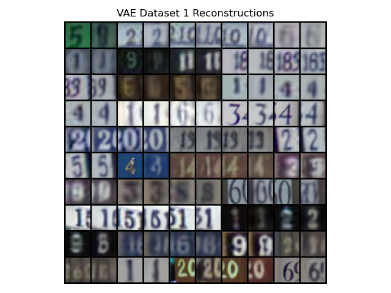
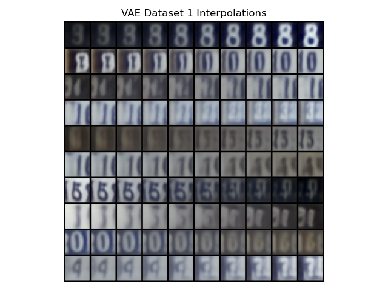

# A Practice on VAE and GANs

Dataset: [SVHN](http://ufldl.stanford.edu/housenumbers/)

Some of my [notes](./notes_vae.pdf) that could be useful.

The main entry point is [VAE.ipynb](VAE.ipynb)

## Variational Autoencoder

